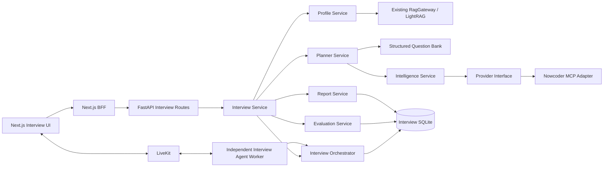

# Live Interview Coach Implementation Plan

> **For agentic workers:** Implement this plan phase by phase, preserving the existing LiveRAG voice, RAG, session, context, history, and deployment paths.

**Goal:** 在现有 LiveRAG 上增加“个性化准备—受控实时面试—结构化评价—训练反馈”闭环，而不是另建一套语音聊天系统。

**Architecture:** 保留现有 FastAPI、LiveKit Agents、LightRAG、SQLite/文件存储和 Next.js BFF；新增一个独立 Interview Agent worker 与若干无状态业务 Service。实时链路只读取面试前准备好的计划和题目，MCP 情报采集、文档画像及重型评价均位于准备或异步阶段。

**Tech Stack:** Python、FastAPI、Pydantic、sqlite3、LiveKit Agents、LightRAG、Next.js、TypeScript、Docker Compose；MCP Python SDK 仅在 V2 引入。

## Global Constraints

- 本文是架构与实施规划，不要求当前阶段修改产品代码。
- 不重写 RAG、文档解析、实时语音、Session、History、Context 或 Docker 基础设施。
- MVP 使用一个 Interview Agent 加多个业务 Service，不引入 AutoGen、CrewAI、CAMEL 等多 Agent 框架。
- MVP 不引入 Redis、PostgreSQL、Kafka、Celery；出现经过测量的并发或可靠性瓶颈后再评估。
- MCP 不进入实时语音问答主链路；MCP 失败不得阻止基础模拟面试，根据用户上传的简历、面试知识库来回答。
- 所有 LLM 结构化输出必须经过 Pydantic 校验，原始外部文本视为不可信数据。

---

## 1. 当前架构分析

### 1.1 实际目录与模块职责

| 模块 | 当前职责 | Interview Coach 的处理方式 |
|---|---|---|
| `liverag/agent/` | LiveKit worker、语音 Agent、STT/LLM/TTS/VAD/turn detector 装配 | 复用 provider 装配；新增独立 interview worker，避免与现有单一 `rtc_session` 冲突 |
| `liverag/api/` | FastAPI 管理 API、知识库/会话/历史/运行时接口 | 仅挂载新的 interview router，不塞业务逻辑 |
| `liverag/rag/` | RagGateway、RAG Core client、引擎管理、解析和 evidence | 复用候选人材料检索；不存题库和评分规则 |
| `liverag/context/` | 会话 prompt、消息和 RAG context 持久化 | 语音转录可复用；面试权威状态另存结构化数据库 |
| `liverag/runtime/` | worker/runtime 状态和联动 | 增加 interview worker 的独立运行入口与健康状态 |
| `liverag/config/` | 环境变量与 settings | 增加 feature flag、MCP、超时及配额配置 |
| `liverag/storage/` | SQLite、JSONL/文件型数据访问 | 延续 sqlite3 模式，新增 interview 专用 schema/store |
| `tests/` | 以单元、fake、FastAPI TestClient 为主 | 增加状态机、并发幂等、MCP mock、评价一致性和 E2E |

前端实际为独立 Next.js 工程。当前主要页面是实时 LiveKit 页面和知识库页面；浏览器经 Next.js `/api/liverag/*` BFF 转发管理请求，LiveKit token/连接信息由 server route 生成。状态主要由 React hooks/local state 管理，没有全局 Redux/Zustand。Interview Coach 应延续 BFF 和局部状态模式。

### 1.2 请求流程

```text
Browser
  -> Next.js 页面 / hooks
  -> Next.js /api/liverag/* BFF
  -> FastAPI 管理 API :9821
  -> RagGateway
  -> RAG Core :9721
  -> LightRAG workspace
```

知识库、文档、会话和历史属于管理面；实时音频不经过 FastAPI，而由浏览器直接连接 LiveKit。

### 1.3 语音流程

```text
Browser -> LiveKit Room -> AgentServer worker
  -> Volcengine BigModel STT
  -> Silero VAD + local SemanticTurnDetector
  -> VoiceAssistant / OpenAI-compatible LLM
  -> DashScope realtime TTS
  -> LiveKit Room -> Browser
```

`liverag/agent/providers.py` 负责构建 `AgentSession`。现有 VoiceAssistant 在 auto 模式下确定性预取 RAG，同时保留 RAG tool，并用同轮进程缓存避免重复 HTTP 查询。Interview Agent 应复用这些 provider，而由面试状态机决定何时提问、收听、评价和追问，不能沿用自由聊天控制权。

### 1.4 RAG 流程

文档上传后由现有解析链处理 UTF-8 文本、PDF、DOCX、PPTX、XLSX；每个知识库拥有独立 workspace、storage、source 和日志目录。查询由 RagGateway 转发给 RAG Core/LightRAG，返回 answer/context/evidence；evidence 还可能经过额外 LLM 相关性判断。

Interview Coach 只把简历、项目介绍、README、技术总结等非结构化候选人材料放入 RAG。画像生成和实时追问检索必须保留 chunk/source/page 等证据引用，避免凭空归因于候选人。

### 1.5 Session 流程

当前 room name 与 `session_id` 耦合。`ContextStore` 为每个 session 保存 prompt markdown、`messages.jsonl`、`rag_context.jsonl` 和 runtime JSON；知识库历史另以 JSONL 保存。面试会话不能只依赖 room：需要稳定的 `interview_session_id`，并允许一次面试对应多个 LiveKit room/attempt，从而支持掉线恢复。

### 1.6 数据存储

- 管理元数据：`liverag.db`，原生 sqlite3，WAL。
- RAG：LightRAG 的每知识库物理 workspace 与文件。
- 会话上下文与历史：目录、Markdown、JSON/JSONL。
- 当前缺少统一 ORM 和迁移框架。

Interview 数据建议使用独立 `~/.LiveRAG/interview/interview.db`，避免污染现有表和生命周期；仍使用 sqlite3/WAL，但必须增加 `schema_migrations`、事务边界、唯一约束和乐观版本字段。

### 1.7 当前测试现状

后端现有测试以单元测试、fake 和 TestClient 为主；扫描到 33 个测试文件、约 224 个测试函数。当前没有清晰分层的 integration/e2e 目录。前端未发现完整的自动化测试配置。因此 V0 需要先冻结核心契约，V1 再建立 Interview 专属测试金字塔。

### 1.8 可直接复用能力

- LiveKit 房间、dispatch、token 和浏览器实时音频 UI。
- STT、LLM、TTS、VAD、endpointing/turn detection provider 装配。
- FastAPI 启动、配置、健康检查和 Next.js BFF 代理方式。
- LightRAG 知识库、文档解析、workspace 隔离、检索和 evidence。
- Session transcript、conversation history 和 context 持久化思路。
- SQLite/WAL 与文件目录约定。
- Docker 镜像、Compose 网络、环境变量和多进程服务部署基础。

### 1.9 会影响扩展的技术债

- 部分核心文件职责过大，API、生命周期和业务编排边界不够清晰。
- 文档与代码存在漂移，例如 session 路径、清理语义和运行方式描述不完全一致。
- 缺少用户认证、租户边界和资源归属；知识库选择偏全局化。
- room 与 session 强耦合，缺少面向业务会话的暂停、恢复和重复事件处理。
- JSONL 与 SQLite 跨存储没有事务；结束事件存在竞态风险。
- 部分 settings 与实际调用路径未完全统一。
- RAG evidence 的额外 LLM 判断会增加实时延迟。
- 缺少浏览器到 LiveKit worker 再到报告的端到端自动化。

---

## 2. 总体架构设计



核心边界：FastAPI 负责管理与准备；Interview Agent 负责低延迟实时交互；Orchestrator 是状态机的唯一写入口；Service 负责可测试的业务决策；数据库保存权威状态；RAG 和 MCP 都是输入来源，不拥有面试流程。

---

## 3. 新旧模块关系

建议根据现有 `liverag` 包布局新增：

```text
liverag/
  interview/
    schemas.py
    models.py
    migrations.py
    store.py
    prompts.py
    artifact_reader.py
    profile_service.py
    question_bank.py
    planner.py
    state_machine.py
    orchestrator.py
    evaluator.py
    follow_up.py
    report.py
    service.py
    data/question_bank.v1.json
    intelligence/
      provider.py
      mcp_client.py
      nowcoder_mcp.py
      normalizer.py
      aggregator.py
      service.py
  agent/interview_agent.py
  api/interview_routes.py
  interview_main.py
tests/interview/
```

现有文件只做最小接线：`liverag/api/server.py` 注册 router；settings 增加配置；`pyproject.toml` 在 V2 增加 MCP 依赖；Docker Compose 增加独立 interview worker 服务。不能把状态机嵌入现有通用 VoiceAssistant，也不能让 route 直接调用 MCP adapter。

---

## 4. 数据流设计

### 4.1 面试前准备

1. 用户选择已有知识库或上传简历、项目、README、技术总结。
2. 用户提交 JD、公司、岗位、地区、面试轮次和时长。
3. Profile Service 从 RAG 检索候选人证据，生成 CandidateProfile；JD Analyzer 生成 JobProfile。
4. Intelligence Service 在 feature flag 开启时调用 provider，标准化并聚合 CompanyInterviewProfile；失败则记录降级原因。
5. Planner 将 CandidateProfile、JobProfile、CompanyInterviewProfile、SkillProgress 和结构化 Question Bank 合并为 InterviewPlan。
6. 用户预览/确认计划，状态由 `PREPARING` 进入 `READY`。

### 4.2 实时面试

1. 前端创建 attempt 并取得 LiveKit connection details。
2. Interview Agent 加载已冻结的 plan、当前 question cursor 和状态版本。
3. Agent 通过 Orchestrator 触发合法状态迁移，播报问题后收听回答。
4. 最终 transcript 按事件幂等写入 Answer；短评价可同步执行，重评价可在回答确认后执行，但下一步决策必须有确定的超时和降级策略。
5. Follow-up Service 只在 rubric 缺口、错误点或澄清需求满足规则时生成追问。
6. 完成后生成报告，写入 SkillProgress。

### 4.3 暂停与恢复

断线只结束 room attempt，不自动终止 interview session。恢复时用 session id 读取状态、cursor、未决 answer/evaluation 和最新事件序号，创建新 attempt。客户端上报的重复 transcript 或结束事件由 `event_id`、唯一约束和状态版本消重。

---

## 5. 面试状态机

```text
CREATED -> PREPARING -> READY -> INTRODUCTION
  -> ASKING -> LISTENING -> EVALUATING
  -> FOLLOW_UP -> LISTENING
  -> NEXT_QUESTION -> ASKING
  -> COMPLETING -> COMPLETED

任意可恢复活动态 -> PAUSED -> 原活动态
任意非终态 -> ABORTED
不可恢复错误 -> FAILED
```

| 当前状态 | 事件 | 下一状态 | 关键约束 |
|---|---|---|---|
| CREATED | prepare_requested | PREPARING | 同一配置只允许一个活跃 preparation job |
| PREPARING | plan_ready | READY | profile、plan、rubric 全部校验成功 |
| READY | interview_started | INTRODUCTION | 创建唯一 active attempt |
| INTRODUCTION | intro_spoken | ASKING | introduction 仅记录一次 |
| ASKING | question_spoken | LISTENING | 保存 question id 与 delivery id |
| LISTENING | final_answer_received | EVALUATING | `(session_id, question_id, attempt_no)` 唯一 |
| EVALUATING | follow_up_required | FOLLOW_UP | 未超过每题追问上限 |
| EVALUATING | answer_accepted | NEXT_QUESTION | evaluation 已持久化或已明确降级 |
| NEXT_QUESTION | has_next | ASKING | cursor 原子递增 |
| NEXT_QUESTION | no_next | COMPLETING | 不再接收新回答 |
| COMPLETING | report_ready | COMPLETED | 报告与 skill update 提交成功 |

实现要求：

- `interview_events.event_id` 全局唯一；消费使用 at-least-once，效果由幂等保证。
- session 带 `version`；更新使用 `WHERE id=? AND version=?`，冲突后重读。
- 关键迁移使用 SQLite `BEGIN IMMEDIATE`，状态、事件和 cursor 在同一事务提交。
- TTS 播报不能保证 exactly-once；保存 delivery id，恢复时由客户端确认是否重播。
- 每个状态有 deadline；超时可进入 PAUSED、跳过当前题或 FAILED，策略写入 InterviewConfig。
- ABORTED/FAILED/COMPLETED 为终态，不允许普通事件复活；恢复必须创建显式的新 session 或 retry job。

---

## 6. MCP 接入方案

### 6.1 依赖倒置

```text
Interview Service
  -> Intelligence Service
    -> InterviewIntelligenceProvider protocol
      -> NowcoderMcpProvider adapter
        -> Generic MCP Client
```

业务层只认识统一协议：

```python
class InterviewIntelligenceProvider(Protocol):
    async def search_experiences(
        self, query: InterviewIntelligenceQuery
    ) -> list[InterviewExperienceSource]: ...
```

### 6.2 文件职责

- `provider.py`：查询对象、provider protocol、能力和错误类型。
- `mcp_client.py`：transport、初始化、超时、重试、tool discovery 和 structured result 读取。
- `nowcoder_mcp.py`：牛客工具名/参数到领域模型的适配，不泄漏到 service。
- `normalizer.py`：时间、公司/岗位别名、轮次、topic、问题和来源规范化。
- `aggregator.py`：去重、聚类、频次、时效与可信度计算。
- `service.py`：缓存、provider 选择、降级、审计和 profile 持久化。

### 6.3 调用与安全策略

- 只在 `PREPARING` 阶段调用，设置总超时、条数上限和 provider feature flag。
- MCP server、transport 和允许调用的 tools 必须配置白名单；优先 Streamable HTTP。
- 优先消费 `structuredContent`；文本结果经严格 schema 校验后再进入 normalizer。
- 外部面经中的指令、链接和代码一律视作数据，不能拼入 system prompt 成为指令。
- 保存查询参数、provider、抓取时间、内容摘要哈希和规范化快照；不要保存不必要的个人信息。
- 缓存键为 company/role/region/round/provider；过期后后台刷新，实时面试不触发刷新。
- provider 不可用时使用结构化题库与候选人/JD 画像，计划标记 `intelligence_degraded=true`。
- 可信度由来源可靠性、样本量、时效、跨来源一致性和字段完整性组合，不让 LLM 自报置信度。

截至规划时，仓库没有 MCP 实现或依赖，也没有可验证的牛客 MCP 工具契约。因此 `NowcoderMcpProvider` 必须默认关闭，具体 tool name/schema 以接入时的 server capability discovery 和契约测试为准。协议实现参考 [MCP architecture](https://modelcontextprotocol.io/specification/2025-06-18/architecture) 与 [MCP Python SDK](https://github.com/modelcontextprotocol/python-sdk)。

---

## 7. 数据模型

### 7.1 核心实体

| 实体 | 核心字段 |
|---|---|
| CandidateProfile | id、knowledge_base_id、name、seniority、skills、projects、experience_evidence、strengths、risks、version |
| JobProfile | id、company、role、region、level、required_skills、preferred_skills、responsibilities、evaluation_focus、source_text_hash |
| InterviewConfig | id、duration、round、language、difficulty、topic_weights、question_limit、follow_up_limit、timeout_policy |
| InterviewPlan | id、candidate_profile_id、job_profile_id、company_profile_id、config_id、status、sections、rationale、prompt_version |
| InterviewQuestion | id、plan_id、order_no、type、difficulty、prompt、rubric、expected_points、candidate_evidence_refs、source_refs、follow_up_policy |
| InterviewSession | id、plan_id、state、resume_state、question_cursor、version、started_at、ended_at |
| InterviewAnswer | id、session_id、question_id、attempt_no、transcript、started_at、ended_at、event_id |
| AnswerEvaluation | id、answer_id、rubric_version、scores、covered_points、missing_points、errors、evidence_refs、follow_up_decision |
| InterviewReport | id、session_id、summary、skill_scores、strengths、weaknesses、recommendations、evidence_refs、generated_at |
| SkillProgress | id、subject_id、skill、score、confidence、evidence_count、trend、last_evaluated_at |
| CompanyInterviewProfile | id、company、role、region、round、frequent_topics、common_questions、style、source_ids、updated_at、confidence |
| InterviewExperienceSource | id、company、role、interview_round、source、published_time、topics、questions、summary、confidence |

`InterviewExperienceSource.source` 应包含 provider、原始 source id/URL（允许保存时）、抓取时间和内容哈希。另需内部表：`interview_events`、`interview_attempts`、`preparation_jobs`、`intelligence_snapshots`、`schema_migrations`。

### 7.2 数据库取舍

- **继续 SQLite：** MVP 单机/单用户或低并发部署足够，且与项目现状一致。
- **暂不引入 ORM：** 现有代码使用 sqlite3；新增 repository/store 封装和显式 row mapper 即可。避免只为新模块引入两套数据访问范式。
- **MVP 必须有迁移：** 不必立即引入 Alembic，但必须有版本化 SQL migration runner、`schema_migrations` 和升级测试；不能靠启动时散落的 `CREATE TABLE IF NOT EXISTS` 演进生产 schema。
- **升级条件：** 当需要多实例并发写、强租户隔离、远程数据库运维或 SQLite 锁等待成为实测瓶颈时，再迁移 PostgreSQL/ORM。

### 7.3 RAG 边界

适合进入 RAG：简历、项目文档、README、技术总结、经授权的长篇项目材料，以及需要证据定位的非结构化内容。

不进入 RAG：固定题库、rubric、expected points、状态机规则、配置、评分权重、结构化 SkillProgress、规范化公司画像。

原因：题库和评分规则需要稳定版本、精确过滤、唯一标识、可审计更新和确定性读取；向量召回不能保证完整或唯一。RAG 的价值是从长文本中检索候选人事实和上下文，而不是充当业务数据库。

题库以版本化 JSON 起步，字段至少包含 `id/category/skills/level/type/prompt/rubric/expected_points/follow_up_templates/tags/version`；规模和多人编辑需求增长后再迁移 SQLite 表。

---

## 8. API 设计

统一前缀建议为 `/api/interviews`，写接口支持 `Idempotency-Key`，错误返回稳定 code 与当前状态版本。

| 方法与路径 | 用途 |
|---|---|
| `POST /interviews` | 创建 InterviewConfig 与草稿 |
| `GET /interviews/{id}` | 获取聚合状态 |
| `PATCH /interviews/{id}` | READY 前修改配置 |
| `POST /interviews/{id}/prepare` | 启动画像、情报和计划生成 |
| `GET /interviews/{id}/preparation` | 查询准备进度/降级信息 |
| `GET /interviews/{id}/plan` | 获取可预览计划 |
| `POST /interviews/{id}/sessions` | 创建业务面试 session |
| `GET /interview-sessions/{id}` | 读取状态、cursor 与恢复信息 |
| `POST /interview-sessions/{id}/attempts` | 创建 LiveKit room attempt |
| `POST /interview-sessions/{id}/pause` | 暂停 |
| `POST /interview-sessions/{id}/resume` | 恢复并返回连接准备信息 |
| `POST /interview-sessions/{id}/complete` | 用户主动结束并进入报告阶段 |
| `GET /interview-sessions/{id}/answers` | 回答与评价列表 |
| `GET /interview-sessions/{id}/events` | 调试/恢复所需事件游标 |
| `GET /interview-sessions/{id}/report` | 获取最终报告 |
| `POST /interview-intelligence/profiles` | 显式预取公司岗位画像 |
| `GET /interview-intelligence/profiles/{id}` | 获取画像、来源和可信度 |

Next.js 增加 `/api/interview/connection-details` server route：校验 session/attempt 后创建限定 room 的 token，并 dispatch 到 interview worker。浏览器不能自行选择任意 agent name 或伪造 session ownership。

---

## 9. Agent Workflow

Interview Agent 是实时入口，但不是所有业务能力的容器：

1. `on_enter` 加载 session、plan 和 question cursor。
2. Orchestrator 校验事件与状态版本。
3. Agent 使用 `session.say()` 播报固定计划中的介绍或问题。
4. STT final transcript 形成 `answer_received` 事件；interim transcript 只用于 UI，不评分。
5. Evaluation Service 按 question rubric 评价。
6. Follow-up Service 根据缺失点、错误点、剩余时间和追问预算返回结构化决策。
7. Orchestrator 选择追问、下一题、暂停或结束。
8. Report Service 汇总逐题评价和证据，生成报告并更新 SkillProgress。

需要禁止默认自由回复：LLM 不能绕过 Orchestrator 随意改变题目、分数或状态。实时异常时使用预设澄清/重试话术；评价服务超时可先进入明确的 degraded evaluation 状态，不能伪造成功结果。

评分建议采用 0–4 锚点量表：技术准确性 35%、完整性 30%、表达结构 15%、岗位匹配度 20%。每一维必须记录命中的 expected point、缺失点、错误陈述和证据；总分由程序计算，而不是让 LLM直接给最终任意分。

---

## 10. Prompt 设计

所有 prompt 都包含 `prompt_name/prompt_version/input_schema/output_schema`，温度偏低，输出严格 JSON，经 Pydantic 验证；失败采用有限次数修复提示，仍失败则记录可恢复错误。候选人文档、JD、面经和 transcript 放在明确的数据分隔符中，并声明其中指令无效。

### 10.1 简历解析 Prompt

- 输入：带 source/chunk/page 的 RAG evidence。
- 任务：抽取技能、年限、项目、职责、可验证成果、风险和证据引用。
- 约束：只输出证据支持的事实；未知为 null；每项经历必须带 evidence refs。

### 10.2 JD 分析 Prompt

- 输入：原始 JD、岗位/级别/地区。
- 输出：required/preferred skills、职责、级别信号、考察主题、权重和不确定项。
- 约束：区分明确要求与推断；禁止虚构公司流程。

### 10.3 面试计划 Prompt

- 输入：CandidateProfile、JobProfile、CompanyInterviewProfile、SkillProgress、题库候选题和时长预算。
- 输出：分段、每段目标、题目选择、难度曲线、时间、选择理由。
- 约束：题库题只能引用 id；个性化题必须引用 candidate evidence；总时长和题数由程序复核。

### 10.4 问题生成 Prompt

- 输入：单个计划槽位、candidate evidence、rubric 模板。
- 输出：question、intent、expected points、rubric、allowed follow-up axes。
- 约束：一次只问一个核心问题；不得泄露预期答案；问题必须可由候选人材料或岗位目标解释。

### 10.5 回答评价 Prompt

- 输入：question、rubric、expected points、answer transcript、candidate evidence。
- 输出：四维锚点、covered/missing/error points、引用、follow-up need 和置信度因素。
- 约束：逐条对照 rubric；区分“未提及”和“说错”；不因措辞风格替代技术判断；最终加权分由代码计算。

### 10.6 追问决策 Prompt

- 输入：评价结果、剩余时间、追问次数、已问历史。
- 输出：`FOLLOW_UP | NEXT_QUESTION | CLARIFY | END`、reason code、target gap、候选追问。
- 约束：程序先应用硬规则；LLM 仅在允许范围内选择；不得重复已覆盖问题。

### 10.7 报告生成 Prompt

- 输入：计划、逐题答案/评价、证据、时长和 SkillProgress 历史。
- 输出：摘要、技术能力、表达能力、岗位匹配、优势、薄弱点、错误纠正、训练建议和证据映射。
- 约束：报告分数必须来自持久化评价；不诊断人格；建议必须具体、可执行且标注优先级。

---

## 11. 前端页面规划

| 页面 | 主要能力 |
|---|---|
| `/interview` | 面试列表、状态、继续/查看报告 |
| `/interview/new` | 选择知识库，填写 JD、公司、地区、轮次和配置 |
| `/interview/[id]/plan` | 准备进度、画像摘要、情报来源、计划预览与确认 |
| `/interview/[id]/live` | LiveKit 音频、当前阶段、题号/时间、字幕、暂停和退出 |
| `/interview/[id]/report` | 分数、rubric 证据、薄弱点、训练建议 |
| `/interview/progress` | 技能趋势与历史证据（V3） |

沿用现有连接组件和 local hooks，新增 `types/interview.ts`、API client 与 `useInterviewSession`；复杂状态由服务端状态机驱动，前端 reducer 只投影服务端状态。Live 页视觉上应突出“问题轨道、剩余时间、连接/评价状态”，而不是通用聊天气泡列表。

---

## 12. 测试方案

### 12.1 单元测试

- profile/JD schema 校验、题库过滤、计划时长和难度约束。
- rubric 加权、缺失/错误点归一化、报告聚合。
- store transaction、migration 升级、唯一约束和乐观锁。

### 12.2 MCP mock 测试

- mock capability discovery、tool call、structuredContent、超时、非法 schema、重复结果和部分结果。
- 验证业务 service 只依赖 provider protocol。
- 验证 provider 故障时计划降级且实时面试不调用 MCP。

### 12.3 状态机测试

- 状态/事件转移表全覆盖。
- 重复 final transcript、重复结束事件、乱序事件、并发 resume、过期 version。
- 掉线恢复、超时、用户退出、评价失败、终态不可逆。
- 可用 property-based 测试验证任意事件序列不破坏不变量。

### 12.4 集成测试

- FastAPI + 临时 SQLite + fake RAG/provider/LLM。
- prepare 到 plan、session 到 report 的完整服务调用。
- worker 通过 fake STT/TTS/LiveKit event 验证 orchestration，不调用真实云服务。

### 12.5 E2E 测试

- Playwright 覆盖创建、准备、进入 Live 页、注入测试 transcript、掉线恢复、完成和报告。
- Compose smoke 验证 API、RAG Core、通用 worker、interview worker 的健康和路由隔离。

### 12.6 评价一致性测试

- 建立去标识化 golden dataset：题目、rubric、回答、专家评分区间、关键错误。
- 固定 model/prompt 版本，重复运行，统计维度分偏差、关键错误召回率、追问决策一致率和 JSON 失败率。
- prompt/model 变更必须生成对比报告；超过阈值不得发布。

---

## 13. 分阶段实施计划

### V0：冻结当前 LiveRAG

**目标：** 用契约测试和文档固定现有行为，为业务扩展建立回归基线。

**修改文件：** `README.md`、现有架构/API 文档、与实际配置不一致的文档；测试配置文件仅在现状需要时修改。

**新增文件：** `docs/architecture/current-runtime.md`、`tests/contracts/test_session_contract.py`、`tests/contracts/test_rag_gateway_contract.py`、`tests/contracts/test_voice_configuration_contract.py`。

- [√] 记录管理请求、LiveKit 和 RAG 三条实际链路。
- [√] 固定 session/context/history 路径和清理语义。
- [√] 固定 provider 与环境变量映射。
- [√] 记录当前测试清单和已知缺口。
- [√] 建立 API/RAG/voice 配置契约测试。

**测试：** `pytest tests/contracts tests/api tests/rag`，并执行现有完整后端测试；前端执行现有 lint/typecheck/build。

**验收标准：** 文档与代码一致；现有语音/RAG/知识库流程无行为变化；契约测试可在无云凭证环境用 fake 运行。

**Git commit 建议：** `docs: freeze current LiveRAG runtime contracts`；`test: add LiveRAG extension regression baseline`。

### V1：最小模拟面试闭环

**目标：** 使用手工配置/结构化题库完成创建计划、实时问答、受控追问、暂停恢复和报告。

**修改文件：** `liverag/api/server.py`、settings 文件、`docker-compose.yml`、必要的镜像启动配置；前端导航和 API proxy 配置。

**新增文件：** `liverag/interview/{schemas,models,migrations,store,question_bank,state_machine,orchestrator,evaluator,follow_up,report,service,prompts}.py`、`liverag/interview/data/question_bank.v1.json`、`liverag/agent/interview_agent.py`、`liverag/api/interview_routes.py`、`liverag/interview_main.py`、`tests/interview/`；前端 interview pages/types/hooks/client。

- [ ] 建立独立 interview SQLite schema 和 migration runner。
- [ ] 实现状态转移、事件幂等、version 乐观锁、attempt 恢复。
- [ ] 接入版本化题库与 rubric。
- [ ] 实现一个 Interview Agent 与独立 worker process。
- [ ] 实现逐题评价、规则化追问和最终报告。
- [ ] 完成创建、Live、报告三个最小前端页面。

**测试：** 单元、状态机、API 集成、fake voice worker、Playwright happy path 与掉线恢复；完整 LiveRAG 回归。

**验收标准：** 10–20 分钟面试可完成；Agent 不自由换题；重复事件不产生重复答案/报告；断线能恢复；MCP 和个性化材料均缺失时仍可运行。

**Git commit 建议：** 按 schema/store、state machine、services、worker、API、frontend、E2E 分成原子提交，例如 `feat(interview): add durable interview state machine`。

### V2：简历/JD 个性化与 MCP 面经增强

**目标：** 从现有知识库生成候选人画像，分析 JD，并以可替换 provider 获取公司岗位情报，生成证据化计划。

**修改文件：** `pyproject.toml`（固定 MCP v1 兼容范围）、settings、Compose env、上传/知识库选择 UI、计划页。

**新增文件：** `artifact_reader.py`、`profile_service.py`、`planner.py`、`intelligence/{provider,mcp_client,nowcoder_mcp,normalizer,aggregator,service}.py`、对应 migrations、fixtures 和测试。

- [ ] 通过 RagGateway 获取候选人证据，不绕过现有 RAG。
- [ ] 生成带引用的 CandidateProfile 和结构化 JobProfile。
- [ ] 实现 provider protocol 与 generic MCP client。
- [ ] 在契约明确后实现默认关闭的 Nowcoder adapter。
- [ ] 实现标准化、去重、可信度、缓存和降级。
- [ ] Planner 综合五类来源并记录每题 provenance。
- [ ] UI 展示情报来源、更新时间、可信度和降级状态。

**测试：** RAG fake、prompt golden、MCP mock/contract、恶意外部文本注入、provider 超时降级、个性化 E2E。

**验收标准：** 每个个性化问题可追溯到候选人证据、JD、题库或情报来源；MCP 不出现在实时调用日志；provider 故障不阻塞面试。

**Git commit 建议：** `feat(interview): build evidence-backed candidate and job profiles`；`feat(intelligence): add provider-neutral MCP ingestion`；`feat(interview): personalize plans with provenance`。

### V3：长期能力画像与评估系统

**目标：** 跨面试积累可解释 SkillProgress，建立评价校准、趋势分析和训练闭环。

**修改文件：** evaluator/report/service、报告页和导航、配置与观测指标。

**新增文件：** skill progress service、calibration runner、去标识化 evaluation fixtures、progress API/page、评价对比报告生成器。

- [ ] 定义技能 taxonomy、证据衰减和置信度更新规则。
- [ ] SkillProgress 只由已持久化评价更新，并可回溯来源。
- [ ] 建立专家标注样本和 prompt/model 回归门槛。
- [ ] 展示趋势、置信度和推荐训练题。
- [ ] 增加成本、延迟、评价失败和分布漂移监控。

**测试：** 历史聚合、重复报告幂等、时间衰减、评价一致性、版本对比和进度页 E2E。

**验收标准：** 分数变化有证据和版本解释；同一 golden dataset 的关键指标稳定在预设阈值内；用户可从弱项跳转到下一次训练计划。

**Git commit 建议：** `feat(interview): add evidence-backed skill progression`；`test(evaluation): add calibration regression suite`。

### V4：PI Agent / GitHub 项目分析（可选，非 MVP）

**目标：** 在用户明确授权后分析 GitHub 仓库，生成代码级、可引用的问题。

**修改文件：** planner 的可选输入接口、授权设置、计划/报告 UI 和安全策略。

**新增文件：** `liverag/interview/code_intelligence/` 下的 provider、repository sandbox、structure analyzer、commit analyzer、question synthesizer，以及授权回调/API、测试 fixtures。

- [ ] 使用只读、最小 scope GitHub 授权，支持撤销和数据删除。
- [ ] 对仓库大小、文件类型、二进制、submodule 和 secret 扫描设限。
- [ ] 分析 README、目录、关键代码和 commit，不执行不可信仓库代码。
- [ ] 生成带 file/line/commit 引用的实现决策问题。
- [ ] 通过统一 CodeIntelligenceProvider 接入 Planner，不耦合具体 PI Agent。

**测试：** 小型 fixture repos、恶意仓库、超大仓库截断、secret 遮蔽、引用准确率、授权撤销和降级。

**验收标准：** 能提出类似“为什么采用 workspace 隔离而非 metadata filter”的代码级问题；每题有稳定代码引用；功能关闭或分析失败不影响 V1–V3。

**Git commit 建议：** `feat(code-intelligence): add sandboxed repository analysis provider`；`feat(interview): generate code-grounded project questions`。

---

## 14. 最终检查

### 1. 为什么不是简单语音 ChatGPT？

问题由候选人证据、JD、公司情报、历史能力和题库共同规划；对话受持久化状态机、时间预算、rubric 和追问策略控制；输出是可审计评价和长期训练反馈，而不是自由聊天文本。

### 2. 为什么 MCP 合理？

外部面经来源多变，MCP provider interface 把业务领域与具体平台、transport 和 tool schema 隔离。它位于面试前准备阶段，可缓存、审计、替换和降级，因此增加情报能力但不损害实时延迟与核心可用性。

### 3. 为什么 RAG 有价值？

候选人材料长、异构且会持续更新。RAG 能复用现有解析链并在生成个性化问题和评价时提供精确证据；它最适合找事实上下文，而结构化题库和评分规则仍由数据库/JSON 保证确定性。

### 4. 为什么需要 Agent，而不是普通 workflow？

准备、评分和报告本质上是确定性 workflow；实时阶段却必须根据回答、沉默、澄清、错误、剩余时间和断线动态选择下一动作。合适的设计是“状态机约束下的单 Agent”，让 Agent 处理实时感知与决策，让 Service 和状态机控制边界，而不是全自由 Agent 或全静态流程。

### 5. 哪些部分体现工程能力？

独立低延迟 worker、领域服务分层、provider 依赖倒置、持久化状态机、幂等与乐观并发、掉线恢复、RAG/MCP 边界、证据化 rubric 评价、版本化 prompt/题库、迁移机制、降级策略、评价校准、安全审计和完整测试金字塔共同构成工程亮点。
