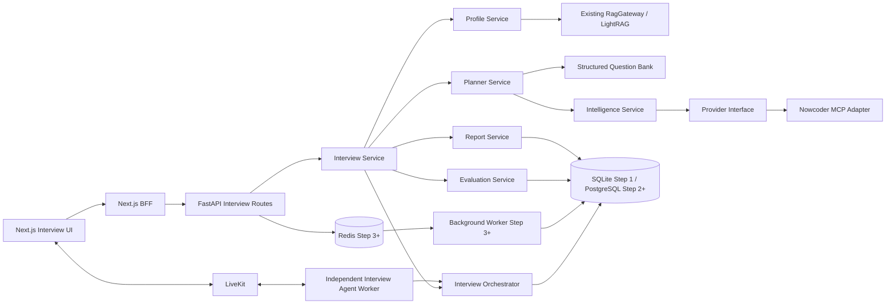

# Live Interview Coach Implementation Plan

> **For agentic workers:** Implement this plan phase by phase, preserving the existing LiveRAG voice, RAG, session, context, history, and deployment paths.

**Goal:** 面向个人求职训练的单用户实时语音模拟面试与长期训练系统。

**Architecture:** Interview Coach 是当前 LiveRAG 上的单用户业务扩展，面向本地或受控个人使用。技术演进严格按照“核心模拟面试闭环—Alembic + PostgreSQL—Redis + Background Worker + MCP—长期能力画像”推进；每一步复用现有 LiveRAG 底座，后一步不得反向成为前一步的前置依赖。

**Tech Stack:** Python、FastAPI、Pydantic、SQLAlchemy、SQLite、LiveKit Agents、LightRAG；第二步增加 Alembic/PostgreSQL，第三步增加 Redis/Background Worker/MCP；前端继续使用 Next.js、TypeScript。

目标组件边界和同步/异步划分可参考 [Interview Coach 目标架构](../INTERVIEW_COACH_ARCHITECTURE.md)；项目定位、全局约束和实际实施先后顺序以本文为唯一依据。

## Global Constraints

- 本文是架构与实施规划，不要求当前阶段修改产品代码。
- V0 LiveRAG 保持原样。
- 不为 Interview Coach 给原知识库表增加归属字段。
- 不为原 Session、History、Context 增加身份关联字段。
- 不修改现有知识库物理 workspace 设计。
- 不修改现有 LiveRAG 的多知识库逻辑。
- 不修改原普通 RAG 语音模式。
- Interview Coach 只通过现有 `kb_id`、`session_id`、`RagGateway` 和 `ContextStore` 复用底座。
- Interview 业务新增字段和表只存在于 Interview 业务域。
- 不因为 Interview Coach 重构整个 LiveRAG 存储层。
- MVP 使用一个 Interview Agent 加多个业务 Service，不引入 AutoGen、CrewAI、CAMEL 等多 Agent 框架。
- 实施顺序固定为：V0 冻结当前 LiveRAG；① 核心模拟面试闭环；② Alembic + PostgreSQL；③ Redis + Background Worker + MCP；④ 长期能力画像；可选增强为 PI Agent / GitHub 项目分析。
- 第一步不得引入 Alembic、PostgreSQL、Redis、Background Worker 或 MCP；先完成单机业务闭环。
- 第二步只完成数据库迁移体系和 PostgreSQL 等价运行，不提前引入 Redis、Background Worker 或 MCP。
- 第三步把耗时任务迁移到一套 Background Worker，用 Redis 承担队列、短期锁和临时协调，并在准备任务中接入 MCP；Redis 不保存权威业务状态。
- 项目允许他人在本地或受控演示环境中操作，但系统不保证不同操作者之间的数据隔离。
- 不引入 Kafka、Kubernetes 或微服务化基础设施。
- MCP 不进入实时语音问答主链路；MCP 失败不得阻止基础模拟面试，根据操作者上传的简历、面试知识库来回答。
- 所有 LLM 结构化输出必须经过 Pydantic 校验，原始外部文本视为不可信数据。

---

## 1. 当前架构分析

### 1.1 实际目录与模块职责

| 模块 | 当前职责 | Interview Coach 的处理方式 |
|---|---|---|
| `liverag/agent/` | LiveKit worker、语音 Agent、STT/LLM/TTS/VAD/turn detector 装配 | 复用 provider 装配；新增独立 interview worker，避免与现有单一 `rtc_session` 冲突 |
| `liverag/api/` | FastAPI 管理 API、知识库/会话/历史/运行时接口 | 仅挂载新的 interview router，不塞业务逻辑 |
| `liverag/rag/` | RagGateway、RAG Core client、引擎管理、解析和 evidence | 复用候选人材料检索；不存题库和评分规则 |
| `liverag/context/` | 会话 prompt、消息和 RAG context 持久化 | 语音转录可复用；面试权威状态另存结构化数据库 |
| `liverag/runtime/` | worker/runtime 状态和联动 | 增加 interview worker 的独立运行入口与健康状态 |
| `liverag/config/` | 环境变量与 settings | 增加 feature flag、MCP、超时及任务配置 |
| `liverag/storage/` | SQLite、JSONL/文件型数据访问 | 第一步收敛为 SQLAlchemy repository + SQLite；第二步再由 Alembic 管理 schema 并接入 PostgreSQL |
| `tests/` | 以单元、fake、FastAPI TestClient 为主 | 增加状态机、并发幂等、MCP mock、评价一致性和 E2E |

前端实际为独立 Next.js 工程。当前主要页面是实时 LiveKit 页面和知识库页面；浏览器经 Next.js `/api/liverag/*` BFF 转发管理请求，LiveKit token/连接信息由 server route 生成。状态主要由 React hooks/local state 管理，没有全局 Redux/Zustand。Interview Coach 应延续 BFF 和局部状态模式。

### 1.2 请求流程

```text
Browser
  -> Next.js 页面 / hooks
  -> Next.js /api/liverag/* BFF
  -> FastAPI 管理 API :9821
  -> RagGateway
  -> RAG Core :9721
  -> LightRAG workspace
```

知识库、文档、会话和历史属于管理面；实时音频不经过 FastAPI，而由浏览器直接连接 LiveKit。

### 1.3 语音流程

```text
Browser -> LiveKit Room -> AgentServer worker
  -> Volcengine BigModel STT
  -> Silero VAD + local SemanticTurnDetector
  -> VoiceAssistant / OpenAI-compatible LLM
  -> DashScope realtime TTS
  -> LiveKit Room -> Browser
```

`liverag/agent/providers.py` 负责构建 `AgentSession`。现有 VoiceAssistant 在 auto 模式下确定性预取 RAG，同时保留 RAG tool，并用同轮进程缓存避免重复 HTTP 查询。Interview Agent 应复用这些 provider，而由面试状态机决定何时提问、收听、评价和追问，不能沿用自由聊天控制权。

### 1.4 RAG 流程

文档上传后由现有解析链处理 UTF-8 文本、PDF、DOCX、PPTX、XLSX；每个知识库拥有独立 workspace、storage、source 和日志目录。查询由 RagGateway 转发给 RAG Core/LightRAG，返回 answer/context/evidence；evidence 还可能经过额外 LLM 相关性判断。

Interview Coach 只把简历、项目介绍、README、技术总结等非结构化候选人材料放入 RAG。画像生成和实时追问检索必须保留 chunk/source/page 等证据引用，避免凭空归因于候选人。

### 1.5 Session 流程

当前 room name 与 `session_id` 耦合。`ContextStore` 为每个 session 保存 prompt markdown、`messages.jsonl`、`rag_context.jsonl` 和 runtime JSON；知识库历史另以 JSONL 保存。面试会话不能只依赖 room：需要稳定的 `interview_session_id`，并允许一次面试对应多个 LiveKit room/attempt，从而支持掉线恢复。

### 1.6 数据存储

- 管理元数据：`liverag.db`，原生 sqlite3，WAL。
- RAG：LightRAG 的每知识库物理 workspace 与文件。
- 会话上下文与历史：目录、Markdown、JSON/JSONL。
- Interview 已建立统一 ORM；正式迁移框架留到第二步引入 Alembic。

Interview 数据已切换为 SQLAlchemy Repository，并在第一步继续只连接 SQLite。原生 `sqlite3` Store 和自定义 migration runner 已移除，当前由 ORM metadata 初始化开发/测试数据库；第二步再引入 Alembic，并让同一数据模型连接 PostgreSQL。状态事件、关键唯一约束和少量乐观版本字段继续保留。

### 1.7 当前测试现状

后端现有测试以单元测试、fake 和 TestClient 为主；扫描到 33 个测试文件、约 224 个测试函数。当前没有清晰分层的 integration/e2e 目录。前端未发现完整的自动化测试配置。因此 V0 需要先冻结核心契约，第一步再建立 Interview 专属测试金字塔。

### 1.8 可直接复用能力

- LiveKit 房间、dispatch、token 和浏览器实时音频 UI。
- STT、LLM、TTS、VAD、endpointing/turn detection provider 装配。
- FastAPI 启动、配置、健康检查和 Next.js BFF 代理方式。
- LightRAG 知识库、文档解析、workspace 隔离、检索和 evidence。
- Session transcript、conversation history 和 context 持久化思路。
- SQLite/WAL 与文件目录约定。
- Docker 镜像、Compose 网络、环境变量和多进程服务部署基础。

### 1.9 会影响扩展的技术债

- 部分核心文件职责过大，API、生命周期和业务编排边界不够清晰。
- 文档与代码存在漂移，例如 session 路径、清理语义和运行方式描述不完全一致。
- 知识库选择偏全局化；Interview 业务必须显式传递并校验 `kb_id`，避免不同知识库的检索上下文混用。
- room 与 session 强耦合，缺少面向业务会话的暂停、恢复和重复事件处理。
- JSONL 与 SQLite 跨存储没有事务；结束事件存在竞态风险。
- 部分 settings 与实际调用路径未完全统一。
- RAG evidence 的额外 LLM 判断会增加实时延迟。
- 缺少浏览器到 LiveKit worker 再到报告的端到端自动化。

---

## 2. 总体架构设计



核心边界：FastAPI 负责管理与准备；Interview Agent 负责低延迟实时交互；Orchestrator 是状态机的唯一写入口；Service 负责可测试的业务决策；数据库保存权威状态；RAG 和 MCP 都是输入来源，不拥有面试流程。

上图展示最终组件关系，不表示所有组件同时实施。第一步只启用 API、SQLAlchemy/SQLite、LiveKit/Agent 和 LightRAG；第二步替换数据库迁移与部署后端；第三步才启用 Redis、Background Worker 与 MCP；第四步实现长期能力画像。

---

## 3. 新旧模块关系

建议根据现有 `liverag` 包布局新增：

```text
liverag/
  interview/
    schemas.py
    records.py
    migrations.py
    store.py
    prompts.py
    artifact_reader.py
    profile_service.py
    question_bank/
      __init__.py
      catalog.py
      converter.py
      enricher.py
      builder.py
      cli.py
      data/question_bank.v1.json
    planner.py
    state_machine.py
    orchestrator.py
    evaluator.py
    follow_up.py
    report.py
    service.py
    intelligence/
      provider.py
      mcp_client.py
      nowcoder_mcp.py
      normalizer.py
      aggregator.py
      service.py
  interview/controller.py
  api/interview_routes.py
  interview_main.py
tests/interview/
```

现有文件只做最小接线：`liverag/api/server.py` 注册 router；settings 增加配置；第一步由 Docker Compose 增加独立 Interview Agent worker，第三步才在 `pyproject.toml` 增加 MCP/Background Worker 依赖和后台 worker 服务。不能把状态机嵌入现有通用 VoiceAssistant，也不能让 route 直接调用 MCP adapter。

---

## 4. 数据流设计

### 4.1 面试前准备

1. 系统把不可删除的默认知识库 `default` 固定命名为“个人简历”；用户在其中更新一份当前简历，并可补充通用项目 README 或经历说明，不在每场面试前重复选择简历库。
2. 用户可以创建多个目标岗位资料库；创建时必须填写公司名称和具体岗位，系统自动按“公司 · 岗位”命名。库内可上传 JD、岗位要求、与该岗位相关的项目 README 和其他准备材料。
3. 创建面试时必须选择一个目标岗位资料库，并填写或确认公司、岗位、轮次和时长。
4. Profile Service 分别从固定个人资料库和所选岗位资料库检索证据，生成 CandidateProfile 与 JobProfile。本场快照保存在 InterviewPlan 中，之后资料更新不会悄悄改变已开始的面试。
5. 公共 Question Bank 是平台内部的版本化数据，只参与 Planner 选题，不作为知识库展示、上传或编辑入口暴露给前端。
6. Intelligence Service 在 feature flag 开启时调用 provider，标准化并聚合 CompanyInterviewProfile；失败则记录降级原因。
7. Planner 将 CandidateProfile、JobProfile、CompanyInterviewProfile、SkillProgress 和结构化 Question Bank 合并为 InterviewPlan。
8. 操作者预览/确认计划，状态由 `PREPARING` 进入 `READY`。

### 4.2 实时面试

1. 前端创建 attempt 并取得 LiveKit connection details。
2. Interview Agent 加载已冻结的 plan、当前 question cursor 和状态版本。
3. Agent 通过 Orchestrator 触发合法状态迁移，播报问题后收听回答。
4. 最终 transcript 按事件幂等写入 Answer；短评价可同步执行，重评价可在回答确认后执行，但下一步决策必须有确定的超时和降级策略。
5. Follow-up Service 只在 rubric 缺口、错误点或澄清需求满足规则时生成追问。
6. 完成后生成报告，写入 SkillProgress。

### 4.3 暂停与恢复

断线只结束 room attempt，不自动终止 interview session。恢复时用 session id 读取状态、cursor、未决 answer/evaluation 和最新事件序号，创建新 attempt。客户端上报的重复 transcript 或结束事件由 `event_id`、唯一约束和状态版本消重。

---

## 5. 面试状态机

```text
CREATED -> PREPARING -> READY -> INTRODUCTION
  -> ASKING -> LISTENING -> EVALUATING
  -> FOLLOW_UP -> LISTENING
  -> NEXT_QUESTION -> ASKING
  -> COMPLETING -> COMPLETED

任意可恢复活动态 -> PAUSED -> 原活动态
任意非终态 -> ABORTED
不可恢复错误 -> FAILED
```

| 当前状态 | 事件 | 下一状态 | 关键约束 |
|---|---|---|---|
| CREATED | prepare_requested | PREPARING | 同一配置只允许一个活跃 preparation job |
| PREPARING | plan_ready | READY | profile、plan、rubric 全部校验成功 |
| READY | interview_started | INTRODUCTION | 创建唯一 active attempt |
| INTRODUCTION | intro_spoken | ASKING | introduction 仅记录一次 |
| ASKING | question_spoken | LISTENING | 保存 question id 与 delivery id |
| LISTENING | final_answer_received | EVALUATING | `(session_id, question_id, attempt_no)` 唯一 |
| EVALUATING | follow_up_required | FOLLOW_UP | 未超过每题追问上限 |
| EVALUATING | answer_accepted | NEXT_QUESTION | evaluation 已持久化或已明确降级 |
| NEXT_QUESTION | has_next | ASKING | cursor 原子递增 |
| NEXT_QUESTION | no_next | COMPLETING | 不再接收新回答 |
| COMPLETING | report_ready | COMPLETED | 报告与 skill update 提交成功 |

实现要求：

- `interview_events.event_id` 全局唯一；消费使用 at-least-once，效果由幂等保证。
- session 带 `version`；更新使用 `WHERE id=? AND version=?`，冲突后重读。
- 关键迁移使用数据库事务，状态、事件和 cursor 在同一事务提交。第一步在 SQLAlchemy + SQLite 上验证条件更新和 `version`；第二步再验证 PostgreSQL 下的等价并发行为。
- TTS 播报不能保证 exactly-once；保存 delivery id，恢复时由客户端确认是否重播。
- 每个状态有 deadline；超时可进入 PAUSED、跳过当前题或 FAILED，策略写入 InterviewConfig。
- ABORTED/FAILED/COMPLETED 为终态，不允许普通事件复活；恢复必须创建显式的新 session 或 retry job。

---

## 6. MCP 接入方案

### 6.1 依赖倒置

```text
Interview Service
  -> Intelligence Service
    -> InterviewIntelligenceProvider protocol
      -> NowcoderMcpProvider adapter
        -> Generic MCP Client
```

业务层只认识统一协议：

```python
class InterviewIntelligenceProvider(Protocol):
    async def search_experiences(
        self, query: InterviewIntelligenceQuery
    ) -> list[InterviewExperienceSource]: ...
```

### 6.2 文件职责

- `provider.py`：查询对象、provider protocol、能力和错误类型。
- `mcp_client.py`：transport、初始化、超时、重试、tool discovery 和 structured result 读取。
- `nowcoder_mcp.py`：牛客工具名/参数到领域模型的适配，不泄漏到 service。
- `normalizer.py`：时间、公司/岗位别名、轮次、topic、问题和来源规范化。
- `aggregator.py`：去重、聚类、频次、时效与可信度计算。
- `service.py`：缓存、provider 选择、降级、审计和 profile 持久化。

### 6.3 调用与安全策略

- 只在 `PREPARING` 阶段调用，设置总超时、条数上限和 provider feature flag。
- MCP server、transport 和允许调用的 tools 必须配置白名单；优先 Streamable HTTP。
- 优先消费 `structuredContent`；文本结果经严格 schema 校验后再进入 normalizer。
- 外部面经中的指令、链接和代码一律视作数据，不能拼入 system prompt 成为指令。
- 保存查询参数、provider、抓取时间、内容摘要哈希和规范化快照；不要保存不必要的个人信息。
- 缓存键为 company/role/region/round/provider；过期后后台刷新，实时面试不触发刷新。
- provider 不可用时使用结构化题库与候选人/JD 画像，计划标记 `intelligence_degraded=true`。
- 可信度由来源可靠性、样本量、时效、跨来源一致性和字段完整性组合，不让 LLM 自报置信度。

截至规划时，仓库没有 MCP 实现或依赖，也没有可验证的牛客 MCP 工具契约。因此 `NowcoderMcpProvider` 必须默认关闭，具体 tool name/schema 以接入时的 server capability discovery 和契约测试为准。协议实现参考 [MCP architecture](https://modelcontextprotocol.io/specification/2025-06-18/architecture) 与 [MCP Python SDK](https://github.com/modelcontextprotocol/python-sdk)。

---

## 7. 数据模型

### 7.1 核心实体

| 实体 | 核心字段 |
|---|---|
| CandidateProfile | id、kb_id、name、seniority、skills、projects、experience_evidence、strengths、risks、version |
| JobProfile | id、company、role、region、level、required_skills、preferred_skills、responsibilities、evaluation_focus、source_text_hash |
| InterviewConfig | id、duration、round、language、difficulty、topic_weights、question_limit、follow_up_limit、timeout_policy |
| InterviewPlan | id、candidate_profile_id、job_profile_id、company_profile_id、config_id、status、sections、rationale、prompt_version |
| InterviewQuestion | id、plan_id、order_no、type、difficulty、prompt、rubric、expected_points、candidate_evidence_refs、source_refs、follow_up_policy |
| InterviewSession | id、plan_id、state、resume_state、question_cursor、version、started_at、ended_at |
| InterviewAttempt | id、session_id、room_name、status、started_at、ended_at、disconnect_reason |
| InterviewAnswer | id、session_id、question_id、attempt_no、transcript、started_at、ended_at、event_id |
| AnswerEvaluation | id、answer_id、rubric_version、scores、covered_points、missing_points、errors、evidence_refs、follow_up_decision |
| InterviewReport | id、session_id、summary、skill_scores、strengths、weaknesses、recommendations、evidence_refs、generated_at |
| SkillProgress | id、candidate_profile_id、skill、attempts、average_score、latest_score、weak_points、confidence、source_evaluation_ids、updated_at |
| CompanyInterviewProfile | id、company、role、region、round、frequent_topics、common_questions、style、source_ids、updated_at、confidence |
| InterviewExperienceSource | id、company、role、interview_round、source、published_time、topics、questions、summary、confidence |
| BackgroundJob | id、job_type、business_resource_id、status、idempotency_key、attempts、error、created_at、updated_at |
| InterviewEvent | id、event_id、session_id、event_type、payload、sequence_no、created_at |

`InterviewExperienceSource.source` 应包含 provider、原始 source id/URL（允许保存时）、抓取时间和内容哈希。`SkillProgress` 直接关联 `CandidateProfile`：同一候选人画像跨面试聚合，不同 `candidate_profile_id` 的记录不得混合。另可保留 `intelligence_snapshots` 等 Interview 业务内部表；迁移版本由 Alembic 管理。

### 7.2 数据库取舍

- **第一步统一数据访问：** Interview Application Layer 先使用 SQLAlchemy + SQLite，不长期维护原生 `sqlite3` Store；这一阶段不引入 Alembic 或 PostgreSQL。
- **第二步统一迁移：** SQLAlchemy 模型稳定后引入 Alembic，并让相同 repository 支持 PostgreSQL。Alembic baseline 必须直接来自现有 ORM metadata，不再维护手写迁移 runner。
- **开发与部署分离：** 第二步完成后，本地开发和轻量测试继续使用 SQLite，集成测试与后续部署使用 PostgreSQL；查询和迁移必须保持跨方言兼容。
- **并发控制：** 第一步只为 Interview Session 等当前关键竞争记录保留 `version`；第三步增加 Background Job 后再为 Job 增加相应条件更新。永久幂等由数据库唯一约束保证。
- **验证要求：** 第一步运行 SQLite 测试；第二步增加 PostgreSQL 集成测试，覆盖 Alembic upgrade、事务、唯一约束、时间类型和并发更新。

### 7.3 RAG 边界

适合进入 RAG：简历、项目文档、README、技术总结、经许可使用的长篇项目材料，以及需要证据定位的非结构化内容。

不进入 RAG：固定题库、rubric、expected points、状态机规则、配置、评分权重、结构化 SkillProgress、规范化公司画像。

原因：题库和评分规则需要稳定版本、精确过滤、唯一标识、可审计更新和确定性读取；向量召回不能保证完整或唯一。RAG 的价值是从长文本中检索候选人事实和上下文，而不是充当业务数据库。

题库以版本化 JSON 起步，字段至少包含 `id/category/skills/level/type/prompt/rubric/expected_points/follow_up_templates/tags/version`；规模或维护复杂度增长后再迁移 SQLite 表。

---

## 8. API 设计

统一前缀建议为 `/api/interviews`，写接口支持 `Idempotency-Key`，错误返回稳定 code 与当前状态版本。

API 只按 `interview_id`、`session_id`、`plan_id`、`candidate_profile_id` 和 `kb_id` 等业务资源 ID 操作。Repository 与 Service 必须校验业务一致性：Interview 是否存在、Session 是否属于指定 Interview、Plan 是否已冻结、`kb_id` 是否存在、状态转换是否合法、`version` 是否冲突、`event_id` 是否重复。上述检查用于维护业务边界和数据一致性。

| 方法与路径 | 用途 |
|---|---|
| `POST /interviews` | 创建 InterviewConfig 与草稿 |
| `GET /interviews/{id}` | 获取聚合状态 |
| `PATCH /interviews/{id}` | READY 前修改配置 |
| `POST /interviews/{id}/prepare` | 启动画像、情报和计划生成 |
| `GET /interviews/{id}/preparation` | 查询准备进度/降级信息 |
| `GET /interviews/{id}/plan` | 获取可预览计划 |
| `POST /interviews/{id}/sessions` | 创建业务面试 session |
| `GET /interview-sessions/{id}` | 读取状态、cursor 与恢复信息 |
| `POST /interview-sessions/{id}/attempts` | 创建 LiveKit room attempt |
| `POST /interview-sessions/{id}/pause` | 暂停 |
| `POST /interview-sessions/{id}/resume` | 恢复并返回连接准备信息 |
| `POST /interview-sessions/{id}/complete` | 主动结束并进入报告阶段 |
| `GET /interview-sessions/{id}/answers` | 回答与评价列表 |
| `GET /interview-sessions/{id}/events` | 调试/恢复所需事件游标 |
| `GET /interview-sessions/{id}/report` | 获取最终报告 |
| `POST /interview-intelligence/profiles` | 显式预取公司岗位画像 |
| `GET /interview-intelligence/profiles/{id}` | 获取画像、来源和可信度 |

Next.js 增加 `/api/interview/connection-details` server route：确认 session/attempt 存在且关联关系正确后，创建限定到该 room 的 token，并 dispatch 到 interview worker。浏览器不能自行选择任意 agent name、room 或把 attempt 关联到其他 Session。

---

## 9. Agent Workflow

Interview Agent 是实时入口，但不是所有业务能力的容器：

1. `on_enter` 加载 session、plan 和 question cursor。
2. Orchestrator 校验事件与状态版本。
3. Agent 使用 `session.say()` 播报固定计划中的介绍或问题。
4. STT final transcript 形成 `answer_received` 事件；interim transcript 只用于 UI，不评分。
5. Evaluation Service 按 question rubric 评价。
6. Follow-up Service 根据缺失点、错误点、剩余时间和追问预算返回结构化决策。
7. Orchestrator 选择追问、下一题、暂停或结束。
8. Report Service 汇总逐题评价和证据，生成报告并更新 SkillProgress。

需要禁止默认自由回复：LLM 不能绕过 Orchestrator 随意改变题目、分数或状态。实时异常时使用预设澄清/重试话术；评价服务超时可先进入明确的 degraded evaluation 状态，不能伪造成功结果。

评分建议采用 0–4 锚点量表：技术准确性 35%、完整性 30%、表达结构 15%、岗位匹配度 20%。每一维必须记录命中的 expected point、缺失点、错误陈述和证据；总分由程序计算，而不是让 LLM直接给最终任意分。

---

## 10. Prompt 设计

所有 prompt 都包含 `prompt_name/prompt_version/input_schema/output_schema`，温度偏低，输出严格 JSON，经 Pydantic 验证；失败采用有限次数修复提示，仍失败则记录可恢复错误。候选人文档、JD、面经和 transcript 放在明确的数据分隔符中，并声明其中指令无效。

### 10.1 简历解析 Prompt

- 输入：带 source/chunk/page 的 RAG evidence。
- 任务：抽取技能、年限、项目、职责、可验证成果、风险和证据引用。
- 约束：只输出证据支持的事实；未知为 null；每项经历必须带 evidence refs。

### 10.2 JD 分析 Prompt

- 输入：原始 JD、岗位/级别/地区。
- 输出：required/preferred skills、职责、级别信号、考察主题、权重和不确定项。
- 约束：区分明确要求与推断；禁止虚构公司流程。

### 10.3 面试计划 Prompt

- 输入：CandidateProfile、JobProfile、CompanyInterviewProfile、SkillProgress、题库候选题和时长预算。
- 输出：分段、每段目标、题目选择、难度曲线、时间、选择理由。
- 约束：题库题只能引用 id；个性化题必须引用 candidate evidence；总时长和题数由程序复核。

### 10.4 问题生成 Prompt

- 输入：单个计划槽位、candidate evidence、rubric 模板。
- 输出：question、intent、expected points、rubric、allowed follow-up axes。
- 约束：一次只问一个核心问题；不得泄露预期答案；问题必须可由候选人材料或岗位目标解释。

### 10.5 回答评价 Prompt

- 输入：question、rubric、expected points、answer transcript、candidate evidence。
- 输出：四维锚点、covered/missing/error points、引用、follow-up need 和置信度因素。
- 约束：逐条对照 rubric；区分“未提及”和“说错”；不因措辞风格替代技术判断；最终加权分由代码计算。

### 10.6 追问决策 Prompt

- 输入：评价结果、剩余时间、追问次数、已问历史。
- 输出：`FOLLOW_UP | NEXT_QUESTION | CLARIFY | END`、reason code、target gap、候选追问。
- 约束：程序先应用硬规则；LLM 仅在允许范围内选择；不得重复已覆盖问题。

### 10.7 报告生成 Prompt

- 输入：计划、逐题答案/评价、证据、时长和 SkillProgress 历史。
- 输出：摘要、技术能力、表达能力、岗位匹配、优势、薄弱点、错误纠正、训练建议和证据映射。
- 约束：报告分数必须来自持久化评价；不诊断人格；建议必须具体、可执行且标注优先级。

---

## 11. 前端页面规划

| 页面 | 主要能力 |
|---|---|
| `/knowledge` | 统一管理不可删除的“个人简历”和多个按“公司 · 岗位”自动命名的目标岗位资料库 |
| `/interviews` | 面试列表、状态、继续/查看报告 |
| `/interviews/new` | 选择一个目标岗位，确认公司、岗位和面试配置；固定使用 `default` 个人简历库 |
| `/interviews/[id]/live` | LiveKit 音频、当前阶段、题号/时间、字幕、暂停和退出 |
| `/interviews/[id]/report` | 分数、rubric 证据、薄弱点、训练建议 |

沿用现有连接组件和 local hooks，新增 `types/interview.ts`、API client 与 `useInterviewSession`；复杂状态由服务端状态机驱动，前端 reducer 只投影服务端状态。Live 页视觉上应突出“问题轨道、剩余时间、连接/评价状态”，而不是通用聊天气泡列表。

---

## 12. 测试方案

### 12.1 单元测试

- profile/JD schema 校验、题库过滤、计划时长和难度约束。
- rubric 加权、缺失/错误点归一化、报告聚合。
- store transaction、migration 升级、唯一约束和乐观锁。
- SkillProgress 的 attempts、平均分、最新分、薄弱点、置信度和评价来源聚合规则。

### 12.2 MCP mock 测试

- mock capability discovery、tool call、structuredContent、超时、非法 schema、重复结果和部分结果。
- 验证业务 service 只依赖 provider protocol。
- 验证 provider 故障时计划降级且实时面试不调用 MCP。

### 12.3 状态机测试

- 状态/事件转移表全覆盖。
- 重复 final transcript、重复结束事件、乱序事件、并发 resume、过期 version。
- 重复 `event_id` 必须幂等，乐观锁冲突必须返回稳定错误并允许调用方重读。
- 掉线恢复、超时、主动退出、评价失败、终态不可逆。
- 可用 property-based 测试验证任意事件序列不破坏不变量。

### 12.4 集成测试

- 第一步使用 FastAPI + SQLAlchemy + 临时 SQLite + fake RAG/provider/LLM；第二步增加 Alembic + PostgreSQL 集成测试。
- prepare 到 plan、session 到 report 的完整服务调用。
- worker 通过 fake STT/TTS/LiveKit event 验证 orchestration，不调用真实云服务。
- 验证不同 Interview 的计划、事件和报告不串；不同 Session 的回答与状态不串。
- 验证不同 `CandidateProfile` 的材料与 SkillProgress 不串；同一 CandidateProfile 下不同面试的能力聚合规则正确。
- 验证不同 `kb_id` 继续映射到各自现有 LightRAG workspace，不混用检索上下文。
- 验证 Session 与 Interview、Plan 冻结状态、`kb_id` 存在性等业务关联约束。

### 12.5 E2E 测试

- Playwright 覆盖创建、准备、进入 Live 页、注入测试 transcript、掉线恢复、完成和报告。
- 第一步验证 API、RAG Core、通用 LiveKit worker 和 interview worker；第三步增加 Background Worker/Redis/MCP 降级 smoke；第四步验证历史能力影响下一次面试的题目权重、难度和复测策略。
- 覆盖 Redis/Worker 重启、PostgreSQL 事务与迁移、LiveKit 掉线恢复，确保恢复后仍绑定原 Interview、Session、CandidateProfile 与 `kb_id` 业务边界。

### 12.6 评价一致性测试

- 建立去标识化 golden dataset：题目、rubric、回答、专家评分区间、关键错误。
- 固定 model/prompt 版本，重复运行，统计维度分偏差、关键错误召回率、追问决策一致率和 JSON 失败率。
- prompt/model 变更必须生成对比报告；超过阈值不得发布。

---

## 13. 分阶段实施计划

### V0：冻结当前 LiveRAG

**目标：** 用契约测试和文档固定现有行为，为业务扩展建立回归基线。

**修改文件：** `README.md`、现有架构/API 文档、与实际配置不一致的文档；测试配置文件仅在现状需要时修改。

**新增文件：** `docs/architecture/current-runtime.md`、`tests/contracts/test_session_contract.py`、`tests/contracts/test_rag_gateway_contract.py`、`tests/contracts/test_voice_configuration_contract.py`。

- [√] 记录管理请求、LiveKit 和 RAG 三条实际链路。
- [√] 固定 session/context/history 路径和清理语义。
- [√] 固定 provider 与环境变量映射。
- [√] 记录当前测试清单和已知缺口。
- [√] 建立 API/RAG/voice 配置契约测试。

**测试：** `pytest tests/contracts tests/api tests/rag`，并执行现有完整后端测试；前端执行现有 lint/typecheck/build。

**验收标准：** 文档与代码一致；现有语音/RAG/知识库流程无行为变化；契约测试可在无云凭证环境用 fake 运行。

**Git commit 建议：** `docs: freeze current LiveRAG runtime contracts`；`test: add LiveRAG extension regression baseline`。

### 第一步：核心模拟面试闭环

**目标：** 使用 FastAPI + SQLAlchemy + SQLite + LiveKit + LightRAG 完成单机 Interview Coach 闭环，并把 Interview 数据访问统一到 SQLAlchemy + SQLite。

**本阶段内部顺序：** 先建立 SQLAlchemy engine/session、ORM models 和 SQLite repository，再把状态机迁移到 Repository Protocol，最后实施 Orchestrator、评价、追问、报告和 LiveKit 接线。数据库基础与状态机接线已经完成，后续代码不得重新引入原生 `sqlite3` Store。

**修改文件：** `pyproject.toml`、`liverag/api/server.py`、Interview settings、现有 API/LiveKit/LightRAG Compose 服务，以及前端导航和 API proxy 配置。

**新增文件：** `liverag/interview/{controller,db,models,repository,sqlalchemy_repository,orchestrator,evaluator,follow_up,report,service,prompts}.py`、`liverag/agent/interview_assistant.py`、`liverag/api/interview_routes.py`、`liverag/interview_main.py`、对应 `tests/interview/`；前端 interview pages/types/hooks/client。

- [√] 建立 Interview SQLite 领域原型、版本化题库、状态机、事件幂等、version 乐观锁和暂停恢复。
- [√] 引入 SQLAlchemy engine/session 和 Interview ORM models，只连接 SQLite。
- [√] 建立 Interview Repository Protocol 和 SQLAlchemy 实现，保持现有 Record/Pydantic 契约。
- [√] 将旧 `InterviewStore` 行为迁移为 Repository 契约测试。
- [√] 让状态机依赖 Repository Protocol，并注入 SQLAlchemy Repository。
- [√] 移除原生 `sqlite3` Store 和自定义 migration runner，使 ORM metadata 成为唯一 schema 来源。
- [√] 完成 Orchestrator、逐题评价、规则化追问和最终报告。
- [√] 通过 FastAPI 暴露创建计划、Session、Attempt、Answer、Event 和 Report 接口。
- [√] 实现独立 LiveKit Interview Agent worker，并继续复用现有 RagGateway/LightRAG 候选人资料基础设施；实时逐轮链路不新增阻塞式 RAG 查询。
- [√] 完成创建、Live、报告三个最小前端页面。
- [√] 将资料入口收敛为唯一个人简历库和多个目标岗位 JD 库；创建面试时选择目标岗位，公共题库不在前端显示。
- [√] 在 InterviewPlan 中冻结 CandidateProfile 与 JobProfile，并用两类画像为公共题库选题加权。

**测试：** SQLAlchemy + 临时 SQLite、状态机、API TestClient、fake voice worker、LightRAG fake、Playwright happy path 与掉线恢复；完整 LiveRAG 回归。

**验收标准：** 单机环境可完成 10–20 分钟面试；FastAPI、SQLAlchemy/SQLite、LiveKit 和 LightRAG 全链路跑通；没有 PostgreSQL、Alembic、Redis、Background Worker 或 MCP 依赖。

**阶段门槛：** 本阶段完成前不得开始 Alembic/PostgreSQL 接入。

### 第二步：Alembic + PostgreSQL ✅

**目标：** 在第一步 SQLAlchemy 模型和 repository 稳定后，建立正式迁移体系，并让同一业务代码在 PostgreSQL 上等价运行。

**状态：** 已完成。

- [x] 以第一步 SQLAlchemy metadata 建立 Alembic baseline；不得从原生建表 SQL 维护第二套模型。
- [x] 配置 SQLite 开发 URL 和 PostgreSQL 集成/部署 URL，repository 不按数据库类型分叉业务逻辑。
- [x] 在 PostgreSQL 上运行 `alembic upgrade head`，验证空库初始化和连续升级。
- [x] 验证事件 + Session + Answer 原子事务、唯一幂等、外键、UTC 时间和 `version` 条件更新（`sqlalchemy_repository.py` 使用 `UPDATE ... WHERE version = expected_version` + 受影响行数检查）。
- [x] 为现有 SQLite 数据提供一次性导出/导入路径，或明确标记可重建的开发数据（选择后者：开发数据标记为可重建，生产通过 Alembic 初始化）。
- [x] Compose 增加 PostgreSQL 健康检查和持久化卷；FastAPI/Agent 只等待 ready，不管理数据库进程。

**数据库策略：**

| 环境 | 数据库 | 说明 |
|------|--------|------|
| 开发 | SQLite | 默认本地数据库，数据可通过 Alembic 重建，不保证历史开发数据迁移 |
| 生产 | PostgreSQL | 使用 Alembic `upgrade head` 初始化，持久化卷 `liverag-postgres-data` |

**验收标准：** 同一业务测试契约在 SQLite 和 PostgreSQL 通过；部署配置使用 PostgreSQL，本地仍可使用 SQLite。

**阶段门槛：** 本阶段不引入 Redis、Background Worker 或 MCP；完成后才能进入第三步。

### 第三步：Redis + Background Worker + MCP ✅

**目标：** 在 PostgreSQL 成为可靠业务数据库后，引入 Redis 和一套 Background Worker，把耗时准备与报告任务移出 FastAPI 请求和实时 LiveKit 主链路，并在后台准备任务中接入可降级的牛客 MCP 面经增强。

**状态：** 已完成。

**修改文件：** `pyproject.toml`、`liverag/config/settings.py`（新增 `RedisSettings`、`WorkerSettings`、`InterviewIntelligenceSettings`）、`docker-compose.yml`（新增 `liverag-interview-worker` + `redis` 服务）、FastAPI lifespan、`liverag/api/interview_routes.py`（新增 `/jobs/`、async preparation、async report 端点）、`liverag/interview/application/service.py`、`liverag/interview/persistence/models.py`（新增 `interview_background_jobs` 表，共 8 张 ORM 表）、`liverag/interview/persistence/sqlalchemy_repository.py`。

**新增文件：**

| 模块 | 文件 | 职责 |
|------|------|------|
| `jobs/` | `repository.py` | `JobRepository` — PostgreSQL BackgroundJob CRUD、状态流转（PENDING→QUEUED→RUNNING→COMPLETED/FAILED）、幂等键查询、有限重试 |
| | `queue.py` | `RedisQueue` — Redis List FIFO 队列（RPUSH/BLPOP）+ 分布式锁（SETNX + Lua 原子释放，token-based owner 验证防止误删） |
| | `tasks.py` | `@register` 注册表 + 5 个 handler：`demo`、`resume_parse`、`profile_generation`、`interview_preparation`、`report_generation` |
| | `worker.py` | `BackgroundWorker` — 异步主循环（兜底扫描→BLPOP→执行→写回），SIGINT/SIGTERM 优雅关闭 |
| | `worker_main.py` | 独立 Worker 进程入口 |
| `intelligence/` | `provider.py` | `InterviewIntelligenceProvider` Protocol + `ProviderError` + 契约模型 |
| | `service.py` | `IntelligenceService` — 缓存检查→Provider调用→规范化→提取→聚合→写缓存，完整降级编排 |
| | `cache.py` | Redis fresh/stale 双层缓存（fresh TTL 1h，stale TTL 24h） |
| | `nowcoder_provider.py` | `NowcoderSpiderProvider` — Query→搜索词→MCP Tool→RawExperience |
| | `normalizer.py` | 确定性规范化（公司别名/岗位别名统一、轮次识别） |
| | `extractor.py` | LLM 从帖子正文提取 questions/topics/interview_round |
| | `aggregator.py` | 去重→主题频率→代表性题目→轮次模式→`CompanyInterviewProfile` |
| | `mcp/` | MCP stdio Client + Nowcoder MCP Server |
| `application/` | `profile_service.py` | `InterviewProfileService` — 通过 RAG 检索生成 CandidateProfile / JobProfile |
| | `planner.py` | `InterviewPlanner` — 从题库 + 画像生成面试计划 |
| | `resume_parser.py` | `ResumeParser` — 简历事实抽取 |

- [x] PostgreSQL 增加持久化 Job 记录（`interview_background_jobs` 表），保存类型、状态、幂等键、业务资源 ID、尝试次数、错误和时间；Redis 只保存队列与可重建协调状态。
- [x] 固定一套 Background Worker 实现，定义有限重试（默认 3 次）、任务超时（默认 300s）、失败状态和安全关闭语义（SIGINT/SIGTERM → 等待当前任务完成）。
- [x] 将简历/JD 结构化、Candidate/Job Profile、Interview Plan 和最终报告生成迁移到后台任务（5 种 job_type，通过 `@register` 装饰器注册）。
- [x] 通过 RagGateway 获取候选人证据，不绕过现有 LightRAG（`KnowledgeContextSource` 注入到 handler）。
- [x] 实现 provider-neutral MCP client（`intelligence/mcp/`）；牛客 adapter 只在 capability discovery 和契约测试通过后启用，并始终在准备任务中运行（5 阶段 preparation workflow：`RESUME_PARSING → CANDIDATE_PROFILE → JOB_PROFILE → COMPANY_INTELLIGENCE → PLAN_GENERATION`，任意阶段失败自动降级）。
- [x] 使用 Redis 短期锁减少相同 preparation/report job 的重复执行（三层幂等：pre-check → Redis SETNX token 锁 → PostgreSQL 唯一约束）；报告生成锁使用 Lua 脚本原子比较 token 后释放，防止"旧任务误删新锁"。
- [x] FastAPI 创建任务后返回 `job_id`；前端通过 `GET /api/interviews/{id}/preparation` 和 `GET /api/interviews/jobs/{job_id}` 轮询 PostgreSQL 中的持久化状态。
- [x] 实时 LiveKit 链路继续同步处理提问、final transcript 和状态迁移，不把逐轮语音事件放入 Redis 队列。

**测试：** Redis/Worker 集成、重复投递、Worker 重启、超时、有限重试、MCP mock/contract、provider 降级、报告幂等（`tests/interview/test_background_jobs.py`），以及实时链路无 Redis round-trip 的回归测试。

**验收标准：** FastAPI 重启后 Job 状态仍在 PostgreSQL；Redis 重启不会丢失已完成业务结果；MCP 不出现在实时调用日志；Worker 故障不破坏基础实时面试。

**阶段门槛：** Redis/Worker 重启、MCP 降级和 PostgreSQL 持久化任务状态全部通过后，才能进入第四步。


### 第四步：长期能力画像

**状态：** ✅ 已完成（2026-08-10）。

**目标：** 基于跨场面试的持久化评价结果，构建可解释、可追溯的长期 `SkillProgress`，形成“历史评价 → 能力状态 → 下一次面试调整”的训练闭环。

* [x] 定义稳定的两级技能 taxonomy，并为题库题目和评价结果建立统一的 skill 映射规则；定义时间衰减、弱点聚合和置信度更新规则，避免由 LLM 直接生成最终能力分或主观置信度。
* [x] `SkillProgress` 以 `candidate_profile_id + skill` 作为能力聚合边界，至少保存：
  * `skill`
  * `attempts`
  * `average_score`：该技能所有历史有效评价的平均分，用于反映长期总体表现
  * `current_score`：考虑时间衰减后的当前能力估计，使近期评价对当前状态具有更高权重
  * `latest_score`：最近一次有效评价分数
  * `weak_points`：归一化、去重后的主要薄弱点，并限制保留数量，避免历史问题无限累积
  * `confidence`：根据有效评价数量、时间分布和评价一致性等确定性规则计算的可信度
  * `source_evaluation_ids`
  * `updated_at`
* [x] `SkillProgress` 只能由已持久化的 `AnswerEvaluation` 更新，不直接依据 transcript、InterviewReport 或 LLM 自由总结修改；每次聚合必须保留 `source_evaluation_ids`，能够回溯到具体题目、回答、rubric 和评价结果。
* [x] 新增独立的 `SkillProgressService`，负责将 `AnswerEvaluation` 映射到对应 skill，并统一完成 `attempts`、历史平均分、时间衰减分、最新分、薄弱点和置信度的增量更新；Evaluator 只负责单题评价，不负责长期能力状态计算。
* [x] Planner 在生成下一次 `InterviewPlan` 时读取历史 `SkillProgress`，但不能完全由历史弱项驱动选题；应同时综合 `JobProfile`、Question Bank 和历史能力状态，在岗位核心能力、薄弱点复测和已掌握知识点抽查之间保持合理比例。
* [x] Planner 可根据 `current_score` 和 `confidence` 调整题目权重与难度：低分且高置信度的技能优先复测；低置信度技能优先补充证据；高分技能仍保留少量抽查，避免能力画像长期失真。
* [x] 增加长期能力进度页面，展示各技能的历史趋势、`average_score`、`current_score`、`latest_score`、置信度、主要薄弱点及其评价来源，并基于当前薄弱项推荐对应训练题。

**测试：**

* 覆盖同一 CandidateProfile 多场 Interview 的 SkillProgress 聚合。
* 验证不同 `candidate_profile_id` 的能力记录严格隔离。
* 验证重复 AnswerEvaluation 或重复报告生成不会导致 SkillProgress 重复累计。
* 验证历史平均分、时间衰减后的 `current_score`、`latest_score` 和 confidence 更新结果符合预期。
* 验证 weak_points 的归一化、去重、淘汰和来源追溯规则。
* 验证 Planner 在存在和不存在历史 SkillProgress 时都能正常生成计划，并确实根据历史能力调整选题权重、难度和复测策略。
* 覆盖评价版本变化后的聚合一致性、历史来源追溯，以及进度页 E2E。

**验收标准：**

同一 `CandidateProfile` 的多场面试评价能够形成稳定、可解释且可追溯的长期技能状态；任一 `SkillProgress` 分数、薄弱点和置信度均能够追溯到具体 `AnswerEvaluation`；不同 CandidateProfile 的材料和能力记录不得混合。

历史能力状态必须实际影响下一次 `InterviewPlan`，系统能够根据岗位核心要求、历史薄弱点和已掌握技能动态调整题目权重、难度和复测策略，同时避免单一弱项长期主导整个面试计划。长期能力画像应形成完整的：

`AnswerEvaluation → SkillProgress → InterviewPlanner → 下一次 InterviewPlan → 新 AnswerEvaluation`

反馈闭环。


### 可选增强：PI Agent / GitHub 项目分析

**前置条件：** 严格在第四步完成后开始。

**目标：** 在操作者明确许可后分析 GitHub 仓库，生成代码级、可引用的问题。

**修改文件：** planner 的可选输入接口、仓库访问许可设置、计划/报告 UI 和安全策略。

**新增文件：** `liverag/interview/code_intelligence/` 下的 provider、repository sandbox、structure analyzer、commit analyzer、question synthesizer，以及仓库访问回调/API、测试 fixtures。

- [ ] 使用只读、最小 scope GitHub 访问凭据，支持撤销和数据删除。
- [ ] 对仓库大小、文件类型、二进制、submodule 和 secret 扫描设限。
- [ ] 分析 README、目录、关键代码和 commit，不执行不可信仓库代码。
- [ ] 生成带 file/line/commit 引用的实现决策问题。
- [ ] 通过统一 CodeIntelligenceProvider 接入 Planner，不耦合具体 PI Agent。

**测试：** 小型 fixture repos、恶意仓库、超大仓库截断、secret 遮蔽、引用准确率、访问撤销和降级。

**验收标准：** 能提出类似“为什么采用 workspace 隔离而非 metadata filter”的代码级问题；每题有稳定代码引用；功能关闭或分析失败不影响主实施路线。

**Git commit 建议：** `feat(code-intelligence): add sandboxed repository analysis provider`；`feat(interview): generate code-grounded project questions`。

---

## 14. 项目完成定义

当前项目在满足以下全部条件时完成：

1. LiveRAG V0 保持稳定。
2. 支持上传简历、项目资料和 JD。
3. 支持生成 CandidateProfile 和 InterviewPlan。
4. 支持实时语音模拟面试。
5. 支持状态机控制。
6. 支持结构化题库。
7. 支持 Rubric / expected_points 评价。
8. 支持动态追问。
9. 支持面试报告。
10. 支持 Alembic + PostgreSQL。
11. 支持 Redis + Background Worker。
12. 支持牛客 MCP 面经增强。
13. 支持长期能力画像。
14. 支持完整测试和本地/受控环境演示。

当前验收不包含身份主体注册与登录、不同操作者的数据权限边界、面向多个租用主体的架构、基于角色的访问控制、按主体的用量上限与收费、面向陌生访问者的互联网入口、运营级并发承载、第三方登录协议、支付或套餐。项目允许他人在本地或受控演示环境中操作，但系统不保证不同操作者之间的数据隔离。

### 最终描述

面向 AI、LLM、RAG 和 Agent 开发者的单用户实时语音模拟面试与长期训练系统。系统基于简历、项目资料、JD、结构化题库和外部面经生成个性化面试计划，通过状态机控制实时语音面试流程，并基于 Rubric 和 expected_points 生成可追溯评价、报告和长期能力画像。

### Future Work

未来若需要面向陌生用户公网开放，可再增加认证、资源归属、限流和隐私保护。该方向不进入当前实施路线或验收标准。

---

## 15. 设计校验

### 1. 为什么不是简单语音 ChatGPT？

问题由候选人证据、JD、公司情报、历史能力和题库共同规划；对话受持久化状态机、时间预算、rubric 和追问策略控制；输出是可审计评价和长期训练反馈，而不是自由聊天文本。

### 2. 为什么 MCP 合理？

外部面经来源多变，MCP provider interface 把业务领域与具体平台、transport 和 tool schema 隔离。它位于面试前准备阶段，可缓存、审计、替换和降级，因此增加情报能力但不损害实时延迟与核心可用性。

### 3. 为什么 RAG 有价值？

候选人材料长、异构且会持续更新。RAG 能复用现有解析链并在生成个性化问题和评价时提供精确证据；它最适合找事实上下文，而结构化题库和评分规则仍由数据库/JSON 保证确定性。

### 4. 为什么需要 Agent，而不是普通 workflow？

准备、评分和报告本质上是确定性 workflow；实时阶段却必须根据回答、沉默、澄清、错误、剩余时间和断线动态选择下一动作。合适的设计是“状态机约束下的单 Agent”，让 Agent 处理实时感知与决策，让 Service 和状态机控制边界，而不是全自由 Agent 或全静态流程。

### 5. 哪些部分体现工程能力？

独立低延迟 worker、领域服务分层、provider 依赖倒置、持久化状态机、幂等与乐观并发、掉线恢复、RAG/MCP 边界、证据化 rubric 评价、版本化 prompt/题库、迁移机制、降级策略、评价校准、安全审计和完整测试金字塔共同构成工程亮点。
